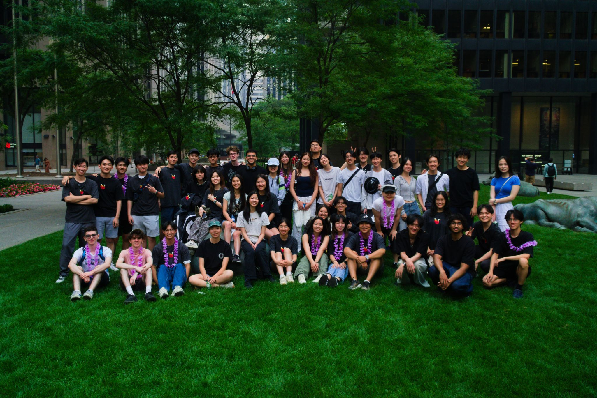
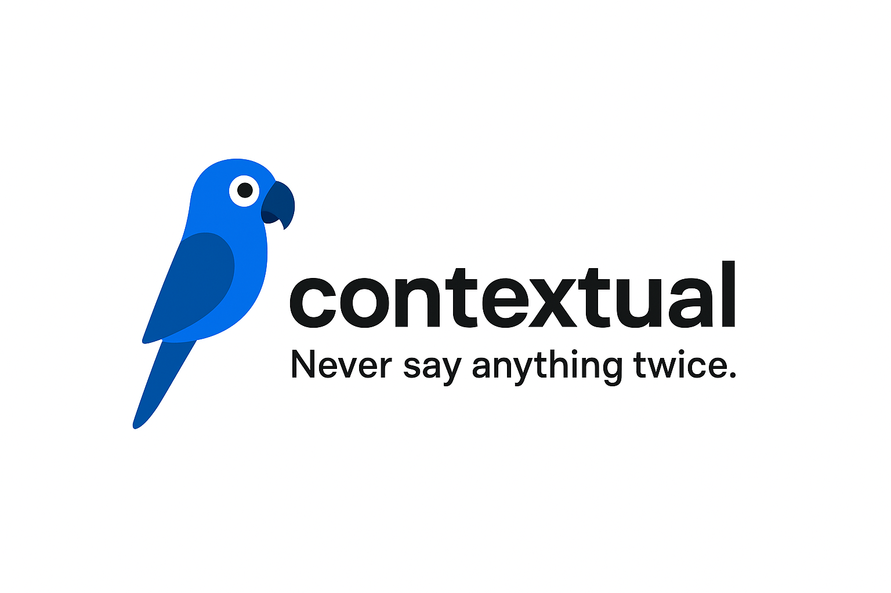
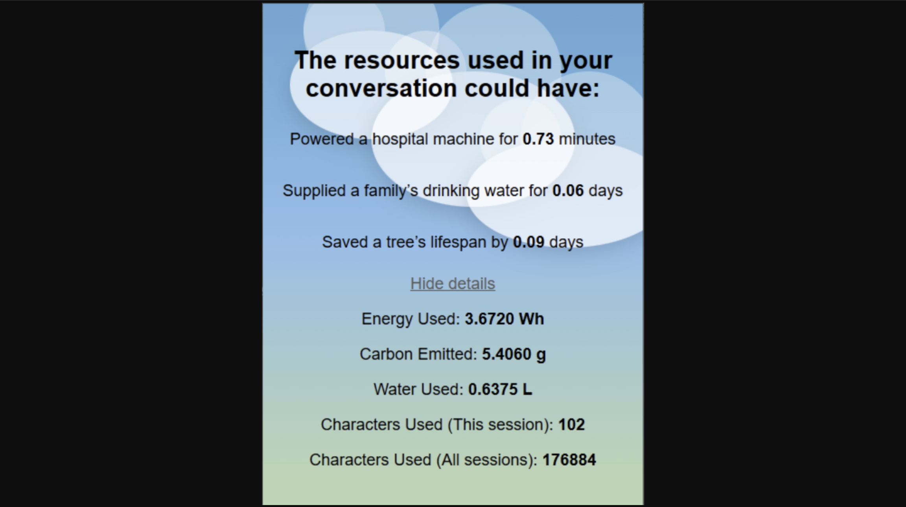

## Convergence

A Capture The Flag meets Turf Wars game in Downtown Toronto for 50+ friends, complete with challenges, merch, and a [custom web app](https://convergencegame.ca/). [YouTube](https://www.youtube.com/watch?v=Gq2RE4Vaz28)

## Contextual

An LLM context manager that lets you select, delete, and combine your chat history so you never have to say anything twice. Built with React, FastAPI, Groq and Anthropic APIs for Hack The North 2025. [Devpost](https://devpost.com/software/contextual-lpqw4m)

## EdgeFund

A digital stock broker using statistics to select a portfolio of stocks, outperforming a combined portfolio of the TSX60 and S&P500 by more than 30% over a 1 year period. Built with Yahoo Finance, Pandas, NumPy, and Jupyter for CFM 101. [GitHub](https://github.com/zhaju/EdgeFund/tree/main)

## SignWave 

An easy to use AI sign language translator which converts text or audio inputs to American Sign Language animations. Built with Flask, OpenCV, MediaPipe, Pytorch, and Whisper, winner of JamHacks VII. [Devpost](https://devpost.com/software/speechtosign) 

## Common Ground

An interactive social media graph visualization platform for Twitter/X, facilitating connection discovery through an LLM-based recommendation engine. Built with D3.js, React, MongoDB, Vite, and Groq for Hack The North 2024. [Devpost](https://devpost.com/software/lockedin-pnvb26?ref_content=my-projects-tab&ref_feature=my_projects) 

## ChatGPTree

A lightweight browser extension which tracks your LLM use and displays its environmental impact in terms of energy, carbon, and water. Best Sustainability Project at CMU TartanHacks 2025 ❤️ [GitHub](https://github.com/zhaju/ChatGPTree) [YouTube](https://www.youtube.com/watch?v=36_AU4sXE_w)

## News Article Bias Analyzer

An AI-powered bias analyzer for news articles which uses sentiment analysis to calculate political leanings. Built with Langchain, Streamlit, and VoyageAI for [Wat.AI's Political LLM team](https://wataiteam.substack.com/p/onboarding-lessons-from-watais-political).

## Elevens

A digital version of the card game Elevens, including a GUI written entirely in object-oriented Java for an ICS4U project. [GitHub](https://github.com/zhaju/Elevens)

