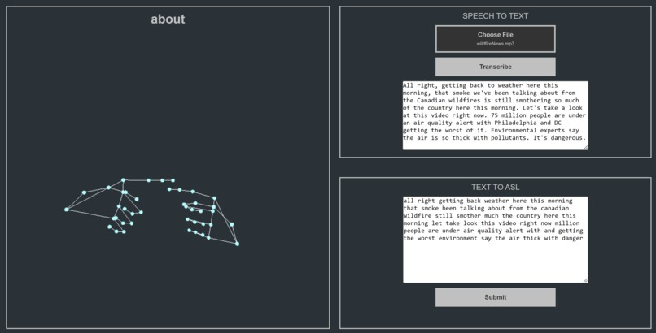
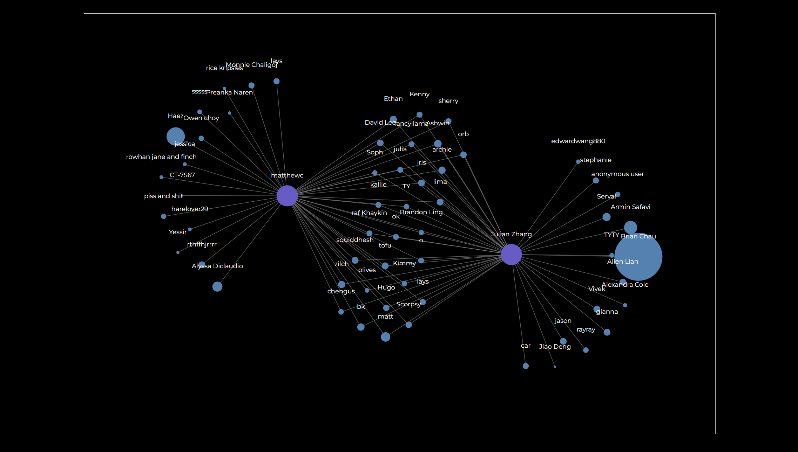
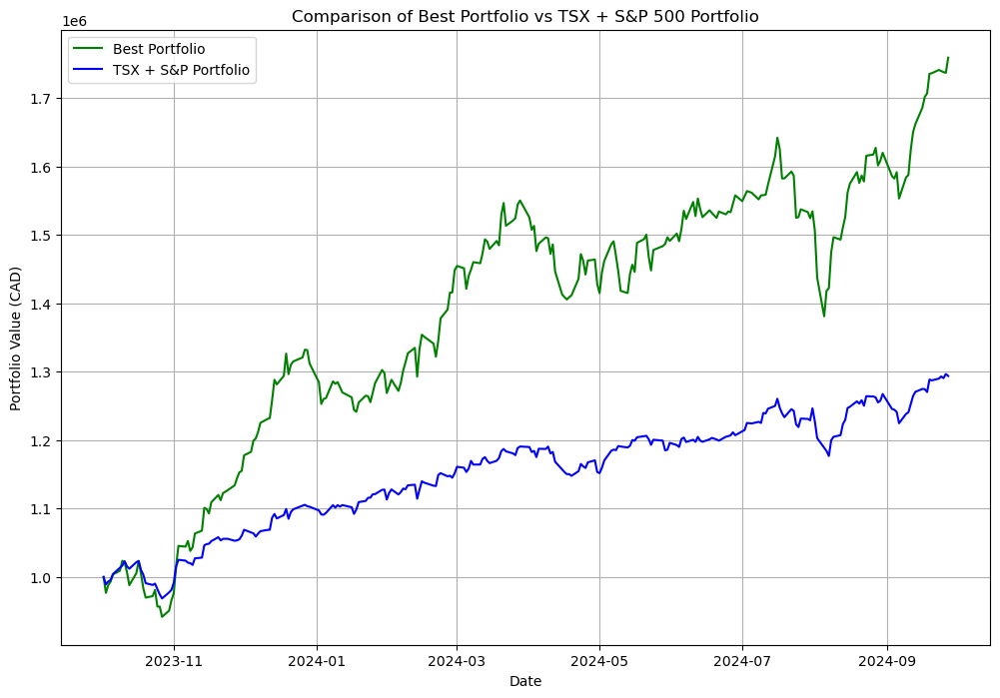
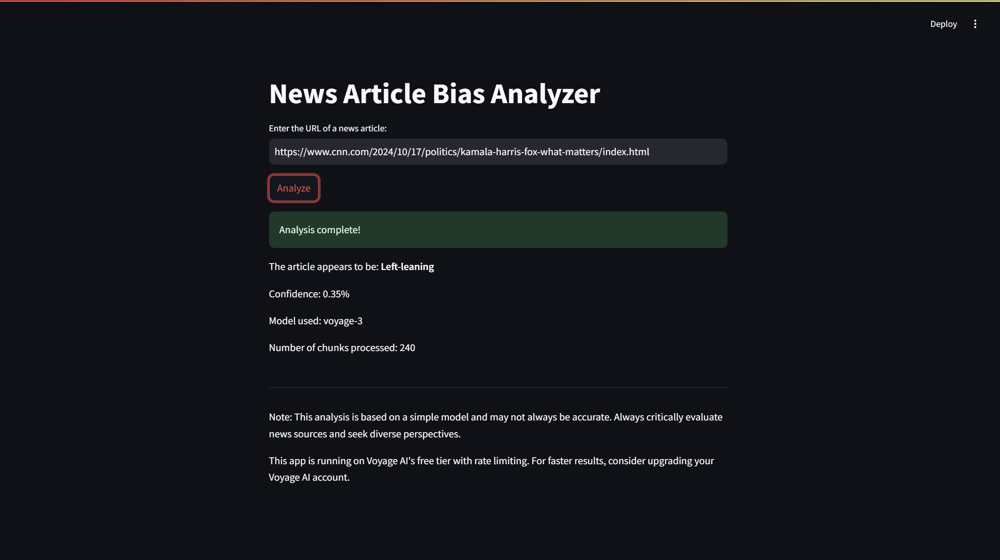
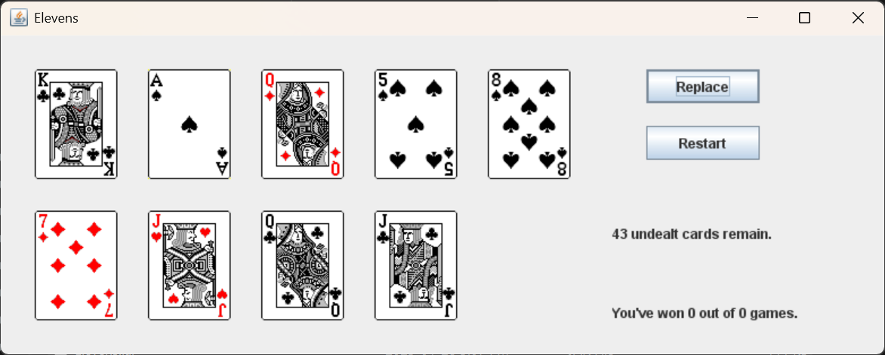
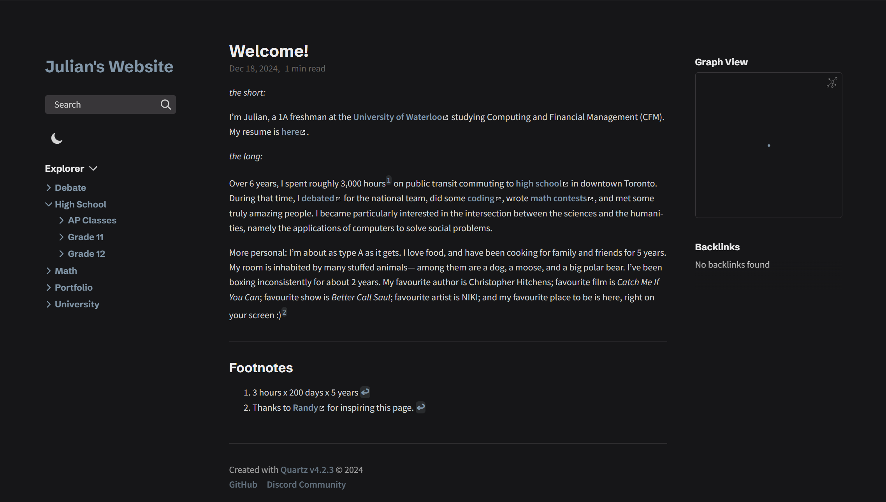

## SignWave 

An easy to use AI sign language translator which converts text or audio inputs to American Sign Language animations. Built with Flask, OpenCV, MediaPipe, Pytorch, and Whisper, winner of JamHacks VII. [Devpost](https://devpost.com/software/speechtosign) [GitHub](https://github.com/tan-ad/SignWave)

## Common Ground

An interactive social media graph visualization platform for Twitter/X, facilitating connection discovery through an LLM-based recommendation engine. Built with D3.js, React, MongoDB, Vite, and Groq for Hack The North 2024. [Devpost](https://devpost.com/software/lockedin-pnvb26?ref_content=my-projects-tab&ref_feature=my_projects) [GitHub](https://github.com/WilliamRChiu/Connections-Search)

## EdgeFund

A digital stock broker using statistics to select a portfolio of stocks, outperforming a combined portfolio of the TSX60 and S&P500 by more than 30% over a 1 year period. Built with Yahoo Finance, Pandas, NumPy, and Jupyter for CFM 101. [GitHub](https://github.com/zhaju/EdgeFund/tree/main)

## News Article Bias Analyzer

An AI-powered bias analyzer for news articles which uses sentiment analysis to calculate political leanings. Built with Langchain, Streamlit, and VoyageAI for [Wat.AI's Political LLM team](https://wataiteam.substack.com/p/onboarding-lessons-from-watais-political).

## Elevens

A digital version of the card game Elevens, including a GUI written entirely in object-oriented Java for an ICS4U project. [GitHub](https://github.com/zhaju/Elevens)

## Personal Website

The website you're currently reading, which hosts my school, debate, math, and coding resources. Built on Quartz v4 utilizing TypeScript and Node.js. [GitHub](https://github.com/zhaju/zhaju.github.io)

