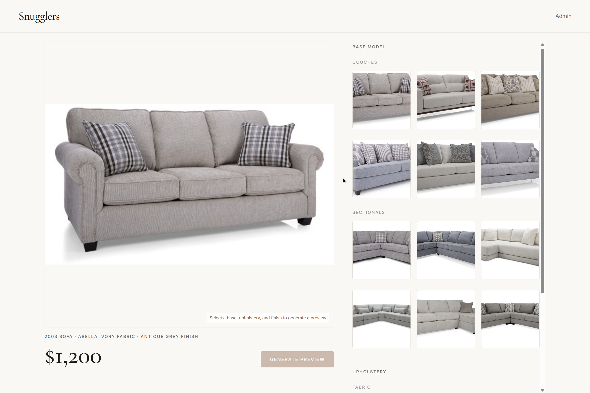

# 1) Sales: Get the meeting
To get the meeting, I started by looking for furniture stores in the area. Since the Waterloo area is home to 3 universities (Waterloo, Laurier, Conestoga), there were about 6 of them clustered in the same area. On 05/27, I visited 6 stores from 2-4 pm. I chose this time because most people are working, so owners would be less busy and more likely to agree to impromptu meetings. Here were the results:

1. [D&S Mattress Furniture](https://maps.app.goo.gl/BpknEiWp1CDD5qgZ8) - owner not here today
2. [Cosmic Homes | Furniture & Mattress Store in Waterloo](https://maps.app.goo.gl/Syf9Zdrh1QspM2KV9) - got business card, owner out of the country
3. [Alaturca Furniture](https://maps.app.goo.gl/pdeMGHaUo2eynwNK7) - closed only on Wednesdays
4. [Hauser Company Stores](https://maps.app.goo.gl/sULr7qPFp1RQ9adY6) - owner not here today
5. [Charterhall Fine Interiors](https://maps.app.goo.gl/XLz2RoFKU1frvUHU7) - “absolutely not”
6. [Snugglers Furniture Design Centre & Warehouse](https://maps.app.goo.gl/QcSGMH8LQ1aJY45a8) - owner not here today

At the final spot, the receptionist seemed excited about the assignment, and wrote down the owners’ email on a business card. I emailed the owner, [Garry](https://www.linkedin.com/in/garry-springer-530b522b/), shortly after, and he agreed to a meeting in a week (06/03). We had a great chat!
# 2) Product: Build a flow
When I asked Garry about problems that he faced on the job, he identified two main ones. First, it was very hard to help customers visualize what customizations on furniture would be like - for instance, what a couch would look like if it had a different kind of fabric and wood finish. Second, since prices are always changing due to sales, market conditions, or supply chain issues, it’s hard to give customers a fast price quote. Usually, employees would have to flip through a list of differently-priced modifications and tally them on the spot, which disrupts the rhythm of the purchasing process.

I ended up building something that solves both the customer-side visualization problem and the staff-side pricing problem. My furniture customization visualizer allows a sales rep to customize a product on the spot based on customers’ demands, and also give them a price quote on the spot. The backend allows staff to change the prices of certain customizations at any time based on any factors. The entire workflow is handled in a single platform while remaining sleek and minimalist.

Deployment: [https://snugglers.vercel.app/](https://snugglers.vercel.app/)  
Demo: [https://www.youtube.com/watch?v=x9ru5uvTLNA](https://www.youtube.com/watch?v=x9ru5uvTLNA)

# 3) Distribution: Write a GTM plan
Garry said that furniture is “a little like fashion”, since there are constantly changing colors, palettes, and textures that you have to keep up with. Because of this, he attends furniture shows 2-3 times a year along with hundreds of other furniture store owners. These shows are located mainly in High Point, North Carolina (the “[furniture capital of the world](https://en.wikipedia.org/wiki/High_Point_Market)”), as well as Las Vegas and Milan in Italy. If I were to launch my product in 3 months, I would certainly set up a table with an interactive live demo at a furniture store.

Snugglers is also part of a furniture buying group called [Mega Group](https://www.megagroup.ca/), whose members include over 700 independent home goods and furnishing retailers. It operates like a cooperative, since stores need to meet certain performance indicators to join. Mega Group provides centralized billing, late payments, early bird discounts, extended buying power, software, and benefits. A lot of its members are store owners in “small-town Canada”, like Sydney, Nova Scotia or Red Deer, Alberta, focusing on small-box furniture that isn’t found at big retailers like Home Depot, Lowes, or Best Buy. For my GTM strategy, I would pitch my product to buying groups like Mega Group, which would give me access to hundreds of independent stores at a time.

In conclusion, the furniture industry is highly connections-driven, and thrives on strong, decades-long relationships between stores, suppliers, and cooperatives. GTM success then becomes about understanding the needs and relationships between people in the industry.
# 4) Appendix
The following are notes from my conversation with Garry:

**What got you into furniture?**
- Snugglers was started 50 years ago by Garry's mother after she experienced a workplace accident
- Garry worked many different jobs: a parole probation officer for maximum security offenders in region of Waterloo for 20 years, running Start Quality Consulting (organizational development firm, taught him about people and teamwork)
- Eventually, he decided to take over the family business, and has owned the store for 20 years

**Being around 3 college campuses, do you get a lot of younger clientele?**
- Student population accommodation has changed in the last 10 years
- Student residences are all pre-furnished now - "its crap"

**Snugglers seems to be a community staple - how important is community to what you do?**
- The store champions custom-made and Made in Canada furniture
- They sponsor local teams and charities
- A lot of stores, especially ones which get commissions on sales tend to be very pushy towards customers
- Garry thinks customer experience is the most important thing

**What parts of your job are annoying, inefficient, or do you wish could be automated?**
- A lot of AI: smart screens acting like sales people
- Taking a picture of a space and putting a product in it, changing configurations of fabrics. colors, etc.
	- Sofa / sectional with 1 vs 2 arms, in blue, different fabric
	- Understanding space and design and flow
	- Fabric rack with 1000s different fabrics
	- Example: [deco-rest.com](http://decor-rest.com/) (3d models)

**What about on the logistics side?**
- Inventory (barcodes), receiving, shipping are all easy
- Prices changes with configurations, fabrics, etc - giving them a quote 
	- Backend to populate all the options
	- Prices change very frequently 

**What things do they read? Listen to? Watch? What conferences do they go to?**
- Furniture shows 2-3x per year
- High Point, North Carolina ("the furniture capital of the world") has furniture shows 2-3x per years, with a bunch of attendees from QC and ON
- Other destinations for shows include Las Vegas and Milan
- "furniture is a little like fashion in style and design: there are constantly changes in colors, palates, and textures that you have to keep up with"

**What sales reps do they have close relationships?** 
- Snugglers is part of a buying group called Mega Group which operates like a cooperative - stores need certain performance indicators to join
- They provide centralized billing, late payments, early bird discounts, extended buying power, software and benefits
- A lot of his connections are store owners in "small-town Canada", like Sydney, Nova Scotia or Red Deer, Alberta
- They focus on small-box furniture, stuff that you can't buy from Home Depot, Lowes, or Best Buy

**These stores are often close to manufacturers and distributors?**
- Garry has close relationships with 6 key manufacturers but works with over 70 in total
- He gets a lot of small items (lamps, decorative pieces) imported, but gets bigger pieces from Canadian manufacturers who have worked with him for 30-40 years
- He runs 2 storefronts in Waterloo (bespoke, high end) and a website (entry level, low end)